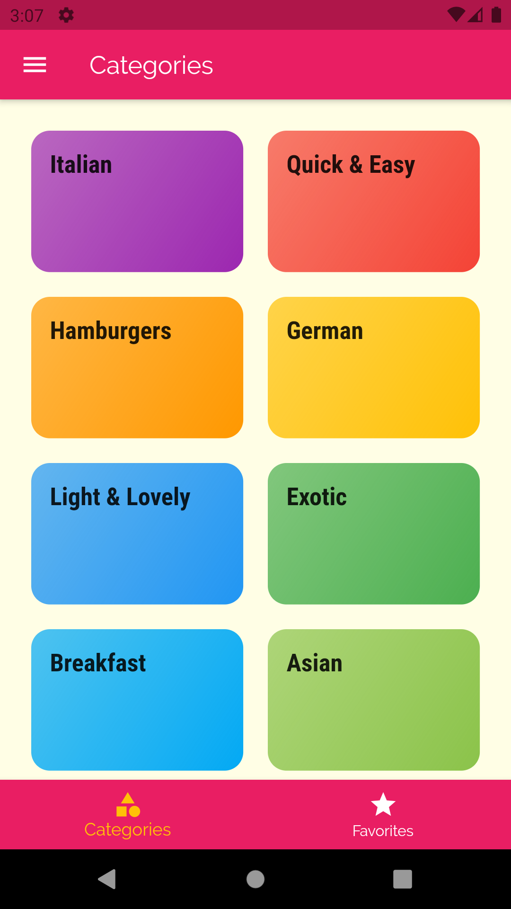
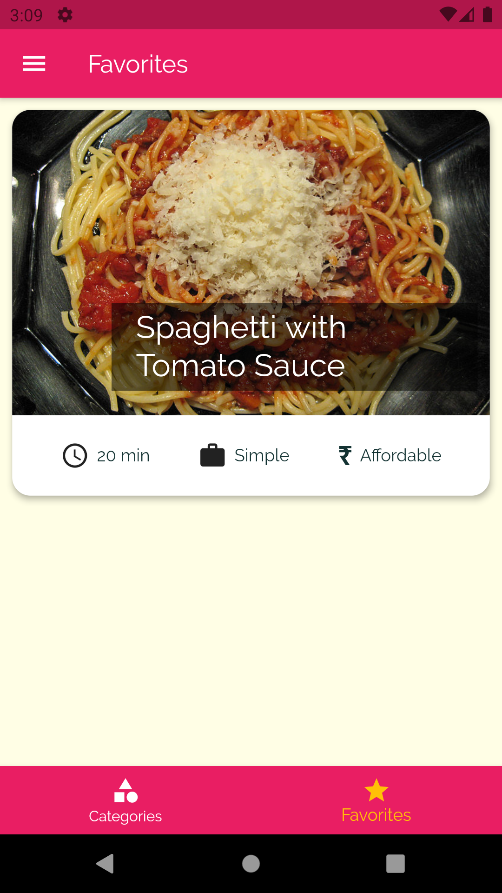
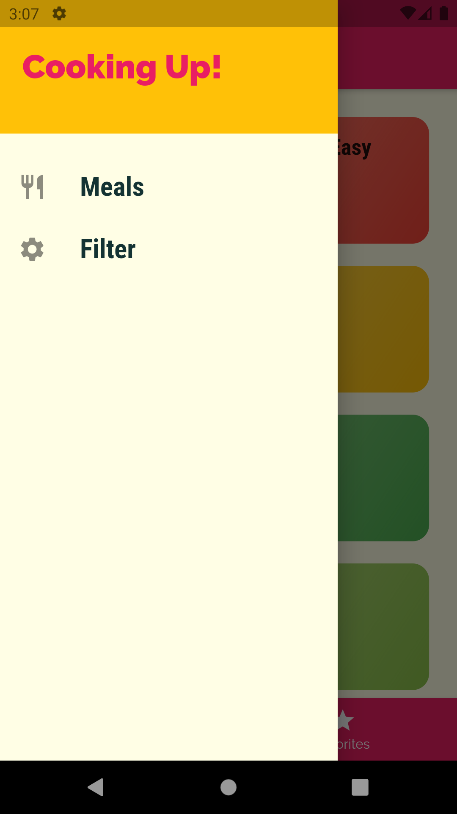
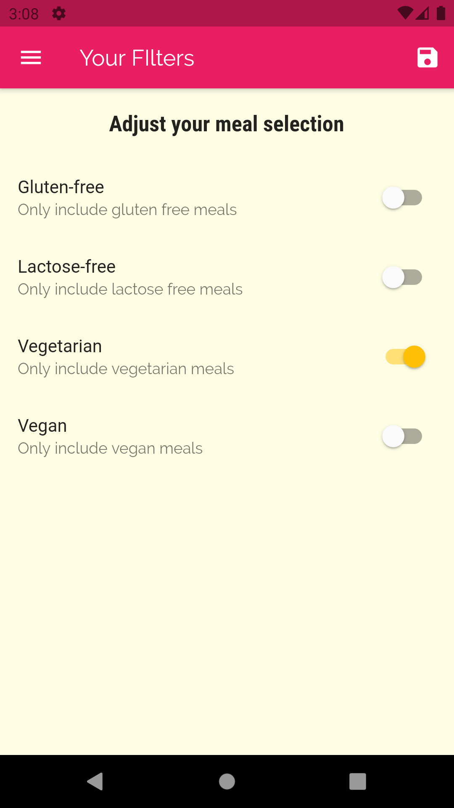
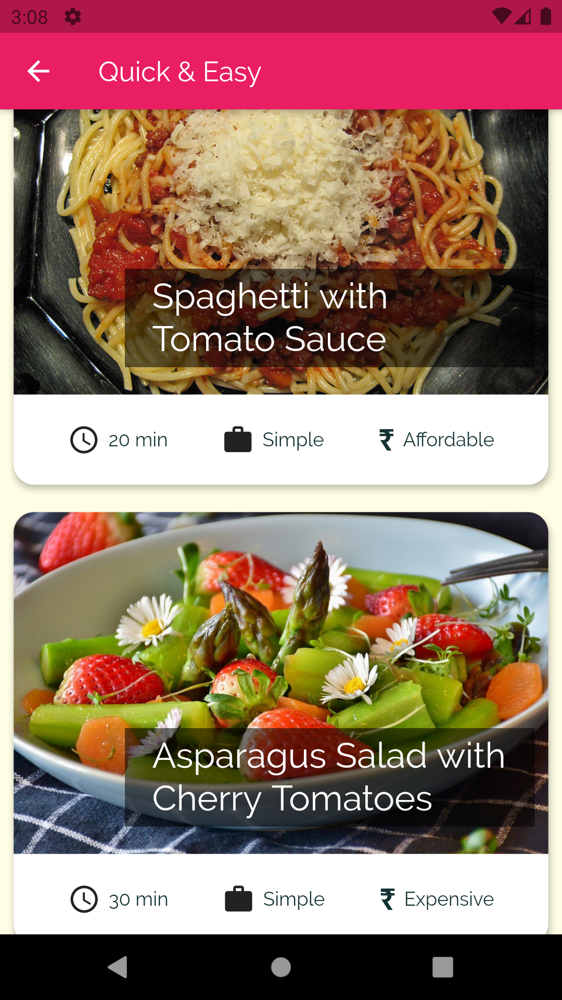
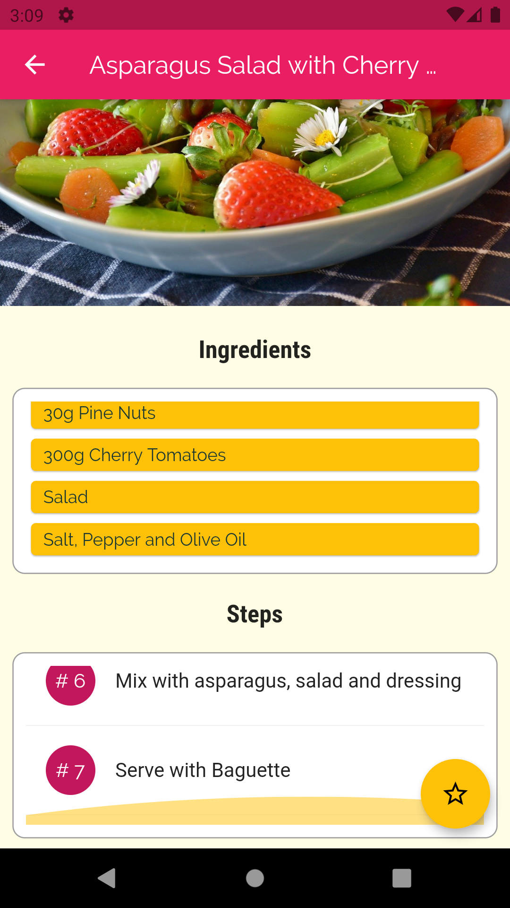

# meals_app
A new Flutter project.
This app is an entry level multi-page cross-platform application developed using flutter.
Thsi application provides Recipes and the cost associated for them. We can filter recipes on the bassis of vegetarian, gluten free or not, etc..

# User Interface

<table>
  <tr>
    <td>Homepage of the app containing categories of meals</td>
     <td>Favorites page with one favorite recipe</td>
     <td>Hamburger Menu</td>
  </tr>
  <tr>
    <td></td>
    <td></td>
    <td></td>
  </tr>
 </table>

<table>
  <tr>
    <td>Filters page with vegetarian switched</td>
     <td>Vegetarian Dishes in the Quick and Easy category</td>
     <td>Ingredients and Steps page for a Dish</td>
  </tr>
  <tr>
    <td></td>
    <td></td>
    <td></td>
  </tr>
 </table>

